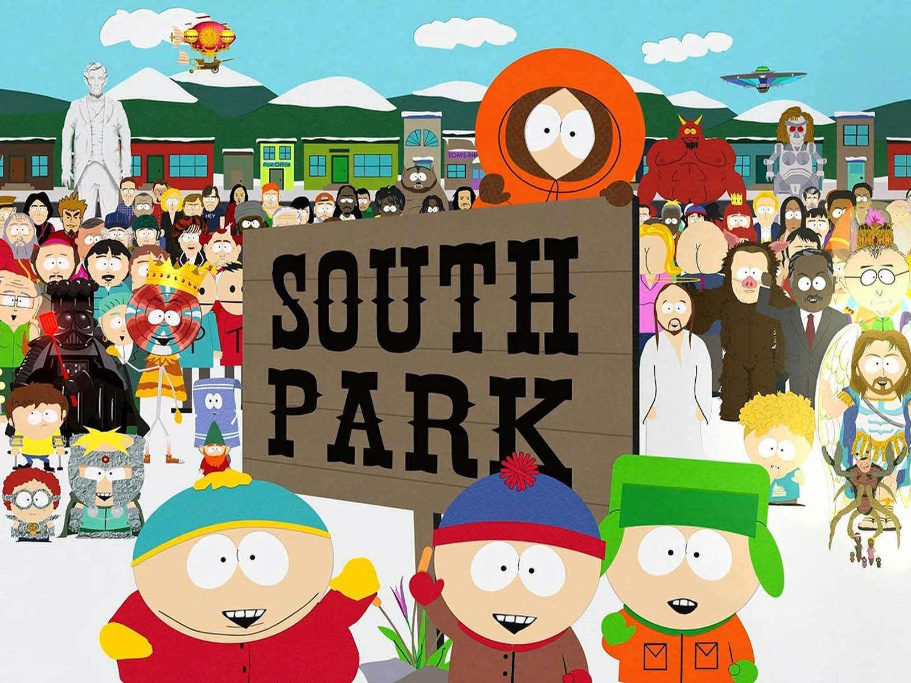

# NLP South Park
## NLP classification analysis based on the script of the TV show south park 

## Overview 
An individual NLP project, with the focus on NLP. It is based on the South Park dataset shared on Kaggle ( https://www.kaggle.com/datasets/mustafacicek/south-park-scripts-dataset?resource=download&select=SouthPark_Lines.csv). This dataset includes the scripts for 309 South Park episodes (up to season 24). In total this results is 95,308 lines in the raw dataset. The goal is to prepare a model which can classify/identify the four main characters of south park based on the spoken line within the tv show.

## Content
The whole project is saved within one jupyter notebook and includes the following sections: 
-	Import section
-	Data Wrangling
-	EDA
-	Modelling 
-	Results

## Goals and Results

### Question:
South Park was broadcasted first in 1997, since this the tv-show produced several controversial episodes. Until today 25 seasons have been published. The main story is about the 4 boys Kyle, Stan, Cartman and Kenny which are visiting the elementary school in the city South Park. Within my project I want to practice my NLP techniques and also find out if there any specific characteristics within the script for the main characters to identify them. 

### Method:
-	Classification task 
-	Target: The script for the 4 main characters

### Main Models used:
-	Logistic Regression
-	KNeighborsClassifier
-	DecisionTreeClassifier
-	XGBClassifier

## Data Cleaning 
To clean data and make is usable for NLP models I adjusted the following:
-	I adjusted the description of the characters as several names were spelled in different versions
-	Dropped missing values 
-	Lowercasing the text.
-	Removing stop words.
-	Removing punctuation and numbers.
-	Lemmatized the text.
-	Filtering the script for the main characters Kyle, Stan, Cartman and Kenny

## Feature Engineering
-	Number of words for each line of the characters
-	Subjectivity - Extracted using the "texblob" package, sentiment analyzer, subjectivity measures how opinionated a text is.
-	Polarity - Extracted as above, polarity measures the positivity of a given text.

## Target Variable
The target variable was the classification for the main characters: 
-	Cartman:  0
-	Kyle:     1
-	Stan:     2
-	Kenny:    3

