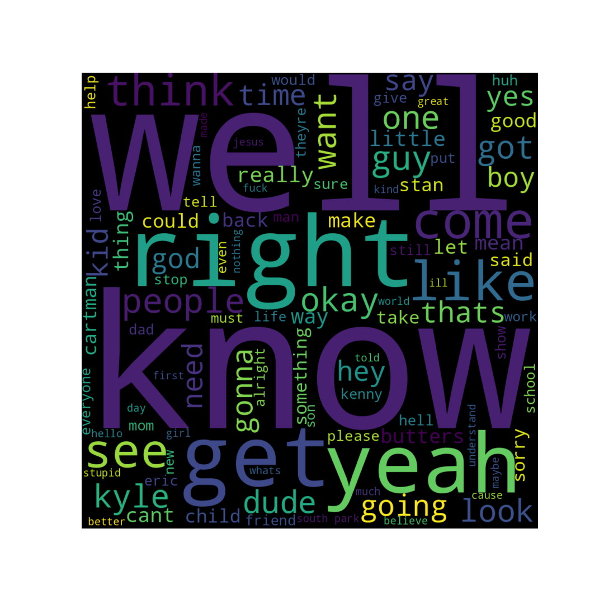
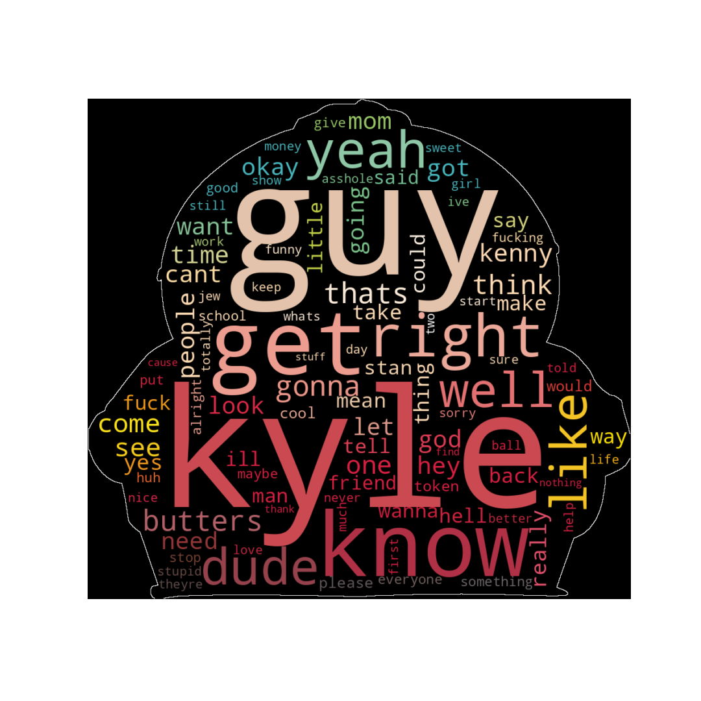
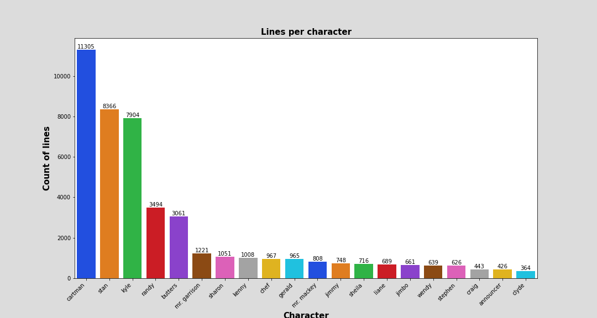
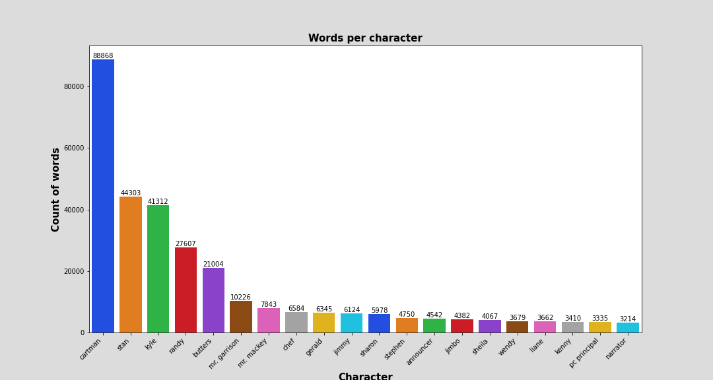

# NLP South Park
## NLP classification analysis based on the script of the TV show south park 

## Overview 
An individual NLP project, with the focus on NLP. It is based on the South Park dataset shared on Kaggle ( https://www.kaggle.com/datasets/mustafacicek/south-park-scripts-dataset?resource=download&select=SouthPark_Lines.csv). This dataset includes the scripts for 309 South Park episodes (up to season 24). In total this results is 95,308 lines in the raw dataset. The goal is to prepare a model which can classify/identify the four main characters of south park based on the spoken line within the tv show.

## Content
The whole project is saved within one jupyter notebook and includes the following sections: 
-	Import section
-	Data Wrangling
-	EDA
-	Modelling 
-	Results

## Goals and Results

### Question:
South Park was broadcasted first in 1997, since this the tv-show produced several controversial episodes. Until today 25 seasons have been published. The main story is about the 4 boys Kyle, Stan, Cartman and Kenny which are visiting the elementary school in the city South Park. Within my project I want to practice my NLP techniques and also find out if there any specific characteristics within the script for the main characters to identify them. 

### Method:
-	Classification task 
-	Target: The script for the 4 main characters

### Main Models used:
-	Logistic Regression
-	KNeighborsClassifier
-	DecisionTreeClassifier
-	XGBClassifier

## Data Cleaning 
To clean data and make is usable for NLP models I adjusted the following:
-	I adjusted the description of the characters as several names were spelled in different versions
-	Dropped missing values 
-	Lowercasing the text.
-	Removing stop words.
-	Removing punctuation and numbers.
-	Lemmatized the text.
-	Filtering the script for the main characters Kyle, Stan, Cartman and Kenny

## Feature Engineering
-	Number of words for each line of the characters
-	Subjectivity - Extracted using the "texblob" package, sentiment analyzer, subjectivity measures how opinionated a text is.
-	Polarity - Extracted as above, polarity measures the positivity of a given text.

## Word Clouds
To get a feeling for the main words used I created some word clouds. Below includes the whole script after the above cleaning of the data.

Additional I created some word clouds for the 4 main character, as an example the one for Cartman below:

## Eploratory Data Analysis 

### Amounf of lines per character

As expected, the first persons with the most lines are also three of the main characters: Cartman, Stan and Kyle. The fourth main character Kenny can only be found on the 8th place. For people who know the tv-show this is not surprising as Kenny is not saying much all the time. I will be interesting to see if the few lines from Kenny will be enough for the models to identify lines from Kenny.

### Words per character
Now that we checked the number of lines per character i also want to have a closer look at the total words of the character. We can see above that Cartman has the most lines within the script, but it could be that he is saying less words than Stan if he has always very short lines.

Cartman, Stan and Kyle are also having the most words. Also, we can see that Cartman has by far the most words within the show. Within the lines overview Kenny was listed on position 8th. Within the overview of the words, he has fallen back to position 18. This will make it probably even harder for the models.

### Sentiment Analysis 

Python sentiment analysis is a methodology for analyzing a piece of text to discover the sentiment hidden within it.  Sentiment analysis allows you to examine the feelings expressed in a piece of text. I want to see if it can also identify if specific characters are more negative than others. 
As a result, I will include two new columns:
1. polarity: This is a float within the range [-1.0, 1.0] where -1.0 is a negative polarity and 1.0 is positive.
2.	Subjectivity: Subjectivity(objectivity) identification task reports a float within the range [0.0, 1.0] where 0.0 is a very objective sentence and 1.0 is very subjective.

|**Character**|**Mean Polarity**|**Mean Subjectivity**|
|:--      |    :-:      |     :-:         |
|Cartman  |0.032168     |0.297806         |
|Kenny    |0.005148     |0.199429         |
|Kyle     |0.016541     |0.328798         |
|Stan     |0.025815     |0.225829         |

Kenny has the lowest mean subjectivity which means he is the most objective of the main characters. The polarity shows that all of them are slightly more positive and Kenny has the lowest mean polarity. But we need to keep in mind that Kenny has not many lines and words during the whole show.

